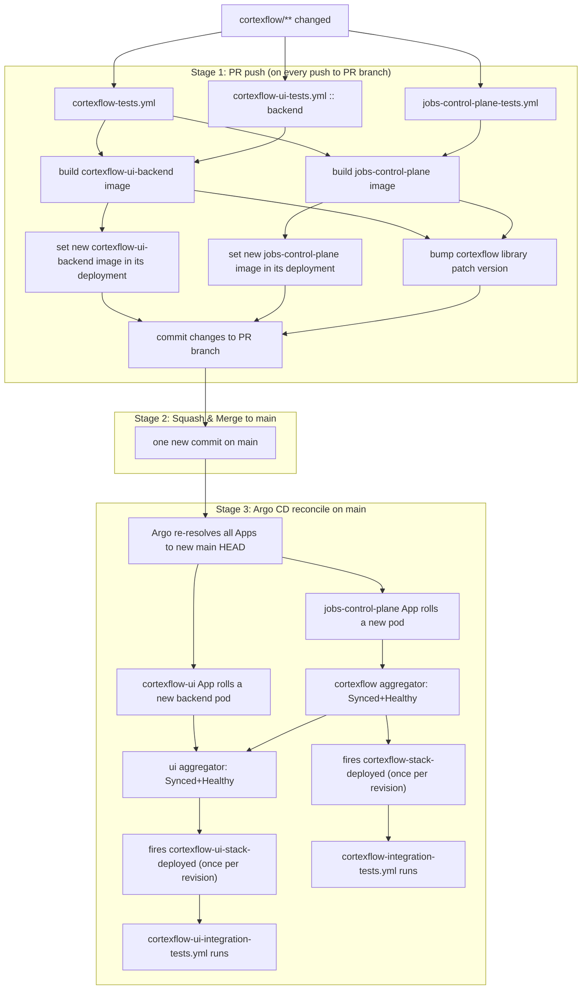
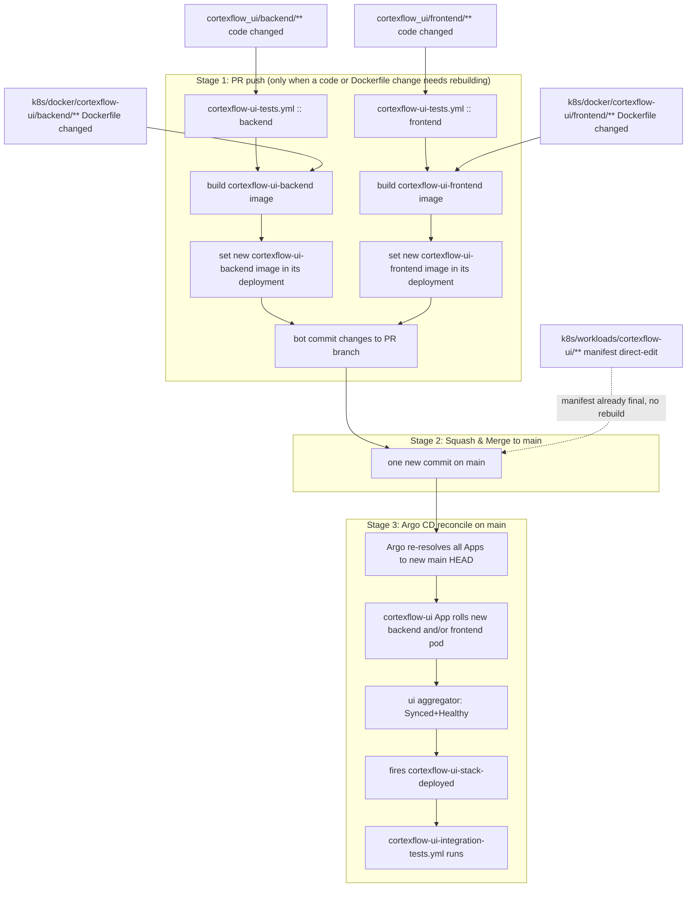
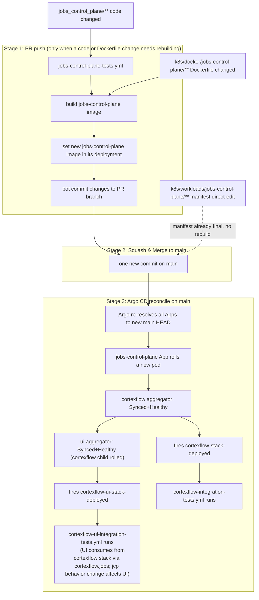
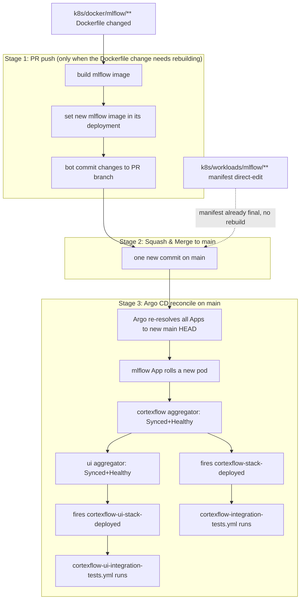
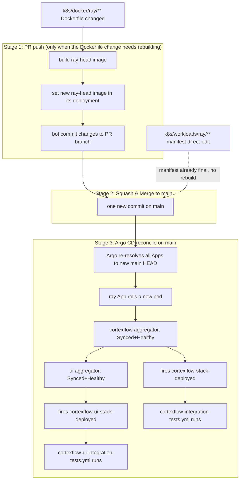
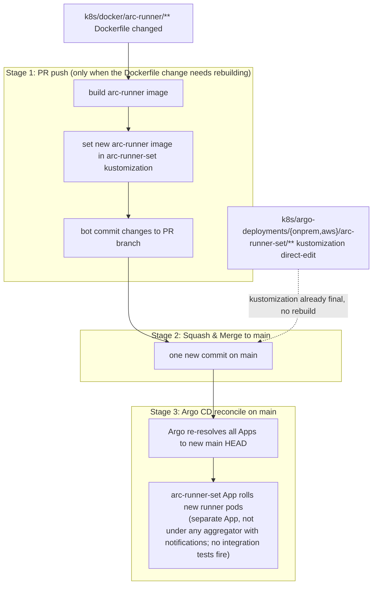
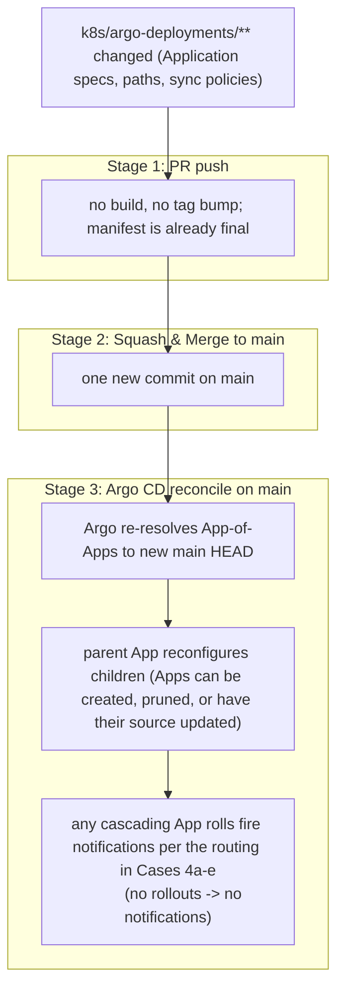
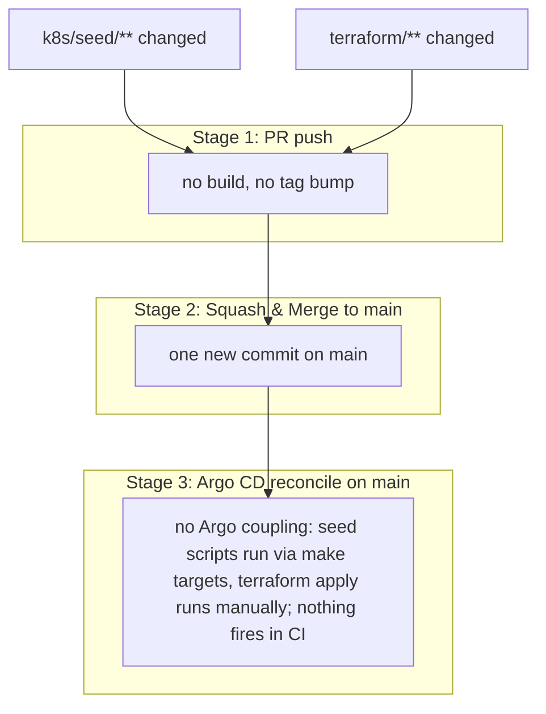

# CI/CD requirements

What the pipeline must guarantee. Implementation lives in [.github/workflows/](../../.github/workflows/).

1. **Tests run on every PR.** Every push to a PR branch re-runs the relevant test suites.

2. **Images are built post-merge, with retry on transient failure.** Image builds happen only after the PR is merged to `main`. Failures caused by anything other than a code error (network timeouts, registry outages, runner flakes) are retried automatically.

3. **Integration tests run only after the full PR is deployed.** They fire only when every image rebuilt for that PR's merge has landed in the Argo-managed environment — never partway through a rollout.

4. **Exactly one integration-test run per PR.**

5. **Exactly one image build per service per PR.**

6. **Only changed services rebuild.** A PR that doesn't touch a service's inputs must not trigger that service's image build.

## Target pipeline

Single principle: every bit of work that determines what main looks like happens **on the PR branch**, so the merge commit is the only new revision on main per PR.

One diagram per case. Every node is tagged with the phase it runs in:

- **[PR push]** — fires every time someone pushes to the PR branch
- **[Merge]** — fires when the PR is squash-merged into `main`
- **[Argo]** — Argo CD reconciling `main` after the merge commit lands

All image builds tag `ghcr.io/<owner>/<service>:<head-sha>` and skip if that tag is already in GHCR; transient failures (network / registry / runner flake) are retried; terminal failures (Dockerfile error) fail the PR.

Mixtures (e.g. `cortexflow/` + `cortexflow_ui/frontend/`) are the union of matching lanes. Every case ends at the same convergence diagram at the bottom.

### Case 1 — `cortexflow/**` (the library)

### Case 2 — `cortexflow_ui` (code, Dockerfile, or manifest)

### Case 3 — `jobs_control_plane` (code, Dockerfile, or manifest)

### Case 4 — `mlflow` (Dockerfile or manifest)

### Case 5 — `ray` (Dockerfile or manifest)

### Case 6 — `arc-runner` (Dockerfile or kustomization)

### Case 7 — `k8s/argo-deployments/**` (Argo Application definitions)

### Case 8 — `k8s/seed/**` or `terraform/**` (no Argo coupling)

Mapping back to requirements:

1. **Tests on every PR** — `pull_request` trigger on the three test workflows.
2. **Robust post-merge build with retry** — moved to PR phase; build step wraps `docker buildx` in a retry loop that distinguishes transient (timeout, 5xx, DNS) from terminal (Dockerfile error, non-zero from `RUN`) failures.
3. **Integration tests only after full PR deployed** — kustomization bumps are inside the merge commit, so Argo's Synced+Healthy on that revision means *all* of the PR's images are rolled out.
4. **Exactly one integration run per PR** — only one new revision per PR (the merge commit); `oncePer: sync.revision` fires once.
5. **Exactly one image build per service per PR** — `detect` skips a service whose `image:<head-sha>` already exists in GHCR, so PR iterations don't redundantly rebuild the same source.
6. **Only changed services rebuild** — `detect` filters per service.

Dependencies / unresolved:

- **Same-repo PR write-back from arc-runners.** `actions/checkout@v4` with `ref: github.head_ref` previously failed with `git fetch` exit 1 on these runners. Root cause not yet diagnosed (research agent recommended repro with `ACTIONS_STEP_DEBUG=true` + `git ls-remote`). PR-side bumps are blocked until this is fixed.
- **`GITHUB_TOKEN` does not re-trigger workflows** ([docs](https://docs.github.com/en/actions/using-workflows/triggering-a-workflow)), so bot bump commits on the PR branch won't loop the tests/build workflows. This is required for the design to terminate.
